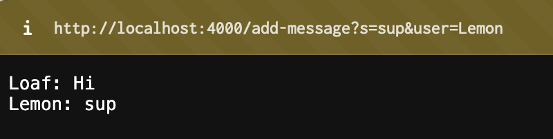
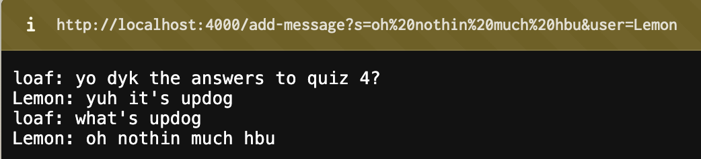
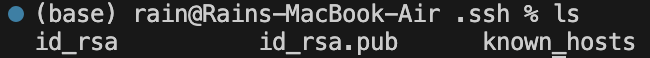
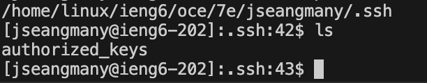
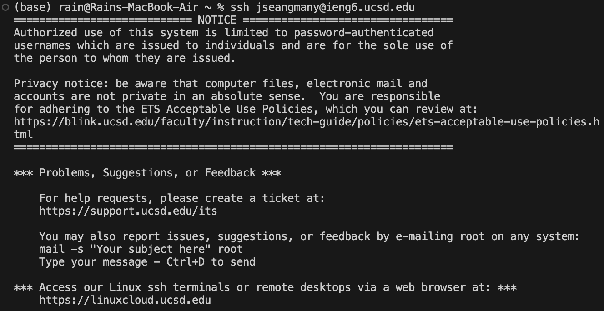

# Lab Blog 2
## Part 1: ChatServer
### ChatServer code:
The following is code for the ChatServer, which takes in a username and a message and outputs and saves the username and message into a webserver.
```
import java.io.IOException;
import java.net.URI;
import java.util.HashMap;
import java.util.Map;

class Handler implements URLHandler {
    // StringBuilder to keep track of chat messages.
    // use instead of int num = 0;
    private StringBuilder chatHistory = new StringBuilder();

    public String handleRequest(URI url) {
        if (url.getPath().equals("/")) {
            return chatHistory.toString().isEmpty() ? "No messages yet!" : chatHistory.toString();
        } else if (url.getPath().equals("/add-message")) {
            // Parse query parameters
            Map<String, String> queryParams = parseQuery(url.getQuery());
            if (queryParams.containsKey("s") && queryParams.containsKey("user")) {
                // Append user, message, and newline to chatHistory
                chatHistory.append(queryParams.get("user"))
                           .append(": ")
                           .append(queryParams.get("s"))
                           .append("\n");
                // Return the entire chat history
                return chatHistory.toString();
            } else {
                return "Invalid query parameters!";
            }
        } else {
            return "404 Not Found!";
        }
    }

    private Map<String, String> parseQuery(String query) {
        Map<String, String> queryParams = new HashMap<>();
        if (query == null || query.isEmpty()) {
            return queryParams;
        }
        // Split the query by '&' and then by '=' to get the key-value pairs.
        for (String param : query.split("&")) {
            String[] pair = param.split("=");
            if (pair.length > 1) {
                queryParams.put(pair[0], pair[1]);
            }
        }
        return queryParams;
    }
}

class ChatServer {
    public static void main(String[] args) throws IOException {
        if (args.length == 0) {
            System.out.println("Missing port number! Try any number between 1024 to 49151");
            return;
        }

        int port = Integer.parseInt(args[0]);

        Server.start(port, new Handler());
    }
}
```
### Screenshots of /add-message
Here is an image of /add-message with two messages.

* Which methods of the code are called?
    * In order to create this, I added `/add-message?s=Hi&user=Loaf` then `/add-message?s=sup&user=Lemon` to the end of the url. This calls the         `handleRequest` method.
* What are the relevant arguments to those methods, and the values of any relevant fields of the class?
    * Relevant argument: `url`: An instance of URI representing the full request URL. In this case, the path is `/add-message` and the query is `s=Hi&user=Loaf` and `s=sup&user=Lemon`.
    * Relevant field: `chatHistory`: A StringBuilder instance that holds the history of chat messages. We can assume that the value is initially empty `("")`.
* How do the values of any relevant fields of the class change from this specific request? If no values got changed, explain why.
    * In the `chatHistory` field, before the request, the value is assumed to be empty `("")`. But, after processing this request, if this is the first message, `chatHistory` will change to `"Loaf: Hi\n"`.


Here is an image of /add-message with four messages.

For the first request, which is the first message in the chat (the "loaf: yo dyk the answers to quiz 4")
* Which methods of the code are called?
    * Simarily, we added the path `/add-message?s=yo dyk the answers to quiz 4?&user=loaf` then added the path `/add-message?s=yuh it's updog&user=Lemon`.
    *  the Methods Called are:
        * `handleRequest(URI url)`
        * `parseQuery(String query)`
* What are the relevant arguments to those methods, and the values of any relevant fields of the class?
    * For the `handleRequest(URI url)`: `url`: Represents the `URI` `/add-message?s=yo dyk the answers to quiz 4?&user=loaf`.
    `chatHistory`: A `StringBuilder` instance holding the history of chat messages. Like in the previous example, we assume initially it's empty `("")`.
    * For the `parseQuery(String query)`: `query`: The string `"s=yo dyk the answers to quiz 4?&user=loaf"`.
 
* How do the values of any relevant fields of the class change from this specific request? If no values got changed, explain why.
    * `queryParams (local variable inside parseQuery)`: After parsing, it holds `{"s": "yo dyk the answers to quiz 4?", "user": "loaf"}`.
    * `chatHistory (class field)`: Changes from `""` to `"loaf: yo dyk the answers to quiz 4?\n"`.

For the second, third, and fourth requests, we follow a similar structure. In summary, for each request:

* The `handleRequest` and `parseQuery` methods are called
* The URI and the query part of the URI are processed, extracting the `user` and `s` (message) parameters
* The `chatHistory` class field is updated by appending the new message, preserving the chat history and adding the new user-message pair on a new line.

## Part 2: SSH Keygen

* The absolute path to the private key for your SSH key for logging into ieng6 (on your computer, an EdStem workspace, or on the home directory of the lab computer)
    * `/Users/rain/.ssh/id_rsa`
    * 
* The absolute path to the public key for your SSH key for logging into ieng6 (this is the one you copied to your account on ieng6, so it should be a path on ieng6's file system)
    * `/home/linux/ieng6/oce/7e/jseangmany/.ssh/authorized_keys`
    * 
* A terminal interaction where you log into your ieng6 account without being asked for a password:
    

  ## Part 3: What I learned

So I learned about hash maps by doing this; which I heard about previously, but this is my first time attempting to actually use it for something. I knew a lot about dictionaries in Python (as I'm more comfortable with Python than java), so I never knew that a hash map was actually just the same as a Python dictionary. It was helpful in writing the code for the chat server and made things easier for me. In terms of web server stuff, it was really nice to know about the parts of a url (like the query and paths) and it was nice to get muscle memory on how to use the terminal quickly. I've been using the tab key a lot when running terminal commands, and I loved the nice and relaxing exploration of paths on my computer. So overall, I learned about hash maps, what the purpose of each part of a url is, and muscle memory for running and starting servers on a terminal.
