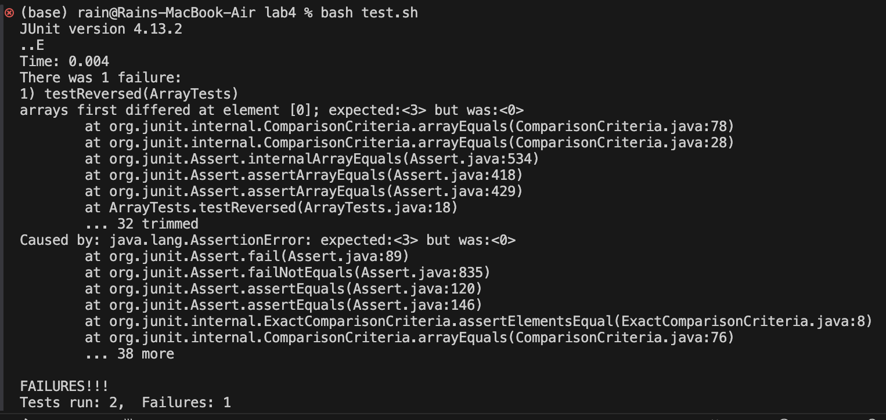
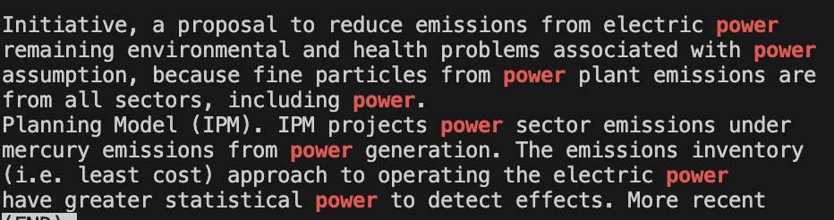
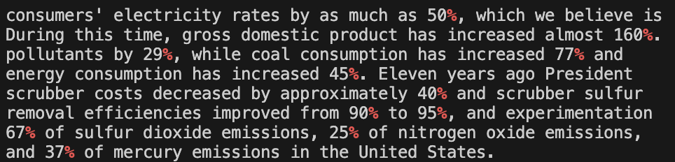

# Lab 3 Bugs and Commands
## Part 1: Bugs
### Code:
```
  static int[] reversed(int[] arr) {
    int[] newArray = new int[arr.length];
    for(int i = 0; i < arr.length; i += 1) {
      arr[i] = newArray[arr.length - i - 1];
    }
    return arr;
  }
```
Here I chose the method "reversed" where it's supposed to reverse an array given any length of an array. For example, an array of {1,2,3} is supposed to return {3,2,1}.
### Faliure Inducing Input:
```
@Test
  public void testReversed() {
    int[] input1 = {1,2,3};
    assertArrayEquals(new int[]{3,2,1}, ArrayExamples.reversed(input1));
  }
```
Here, the failure inducing input is really any value other than an input array of all zeroes or any array length that is not size 1, but I chose {1,2,3} as my failure inducing input.
### Input that does not induce a failure:
```
@Test
  public void testReversed() {
    int[] input1 = {0,0,0};
    assertArrayEquals(new int[]{0,0,0}, ArrayExamples.reversed(input1));
  }
```
The code is broken so that only an empty array would work, so this input of {0,0,0} actually runs successfully and does not induce a failure.
### Symptom

Here is what happens when I try to run the test. There is one failure and one pass, where the failure is when I input the {1,2,3} array.
### Before and After
Before:
```
  static int[] reversed(int[] arr) {
    int[] newArray = new int[arr.length];
    for(int i = 0; i < arr.length; i += 1) {
      arr[i] = newArray[arr.length - i - 1];
    }
    return arr;
  }
```

After:
```
  static int[] reversed(int[] arr) {
    int[] newArray = new int[arr.length];
    for(int i = 0; i < arr.length; i += 1) {
      newArray[i] = arr[arr.length - i - 1];
    }
    return newArray;
  }
```

The change is switching arr[i] to newArray[i],switching nerArray[arr.length - i - 1]; to arr[arr.length - i - 1]; (in line 4), and returning newArray instead of arr. The "before" code would just set all elements of `arr` to 0 because `newArray` is an array of zeroes. Now, the code actually iterates over `arr` and for each `i` it places `arr[arr.llength - i - 1` into `newArray[i]`, which reverses the order of elements from `arr` into `newArray`. `newArray`, which also does not modify the original array and returns the new array.
## Part 2: Researching Commands

### Search for multiple patterns with `-e`

  1. 

  ```
(base) rain@Rains-MacBook-Air 911report % grep -e "Bin Ladin" -e "Obama" chapter-10.txt
                    Bin Ladin;
                Pakistan and Afghanistan." The paper took it as a given that Bin Ladin would
                therefore detailed specific U.S. demands for the Taliban: surrender Bin Ladin and
                Bin Ladin. Shortly thereafter, President Bush authorized broad new authorities for
                administration knew that theTaliban was unlikely to turn over Bin Ladin.
                out that Bin Ladin resented the secularism of Saddam Hussein's regime. Finally, the
                memo said, there was no confirmed reporting on Saddam cooperating with Bin Ladin on
                at the same time-not only Bin Ladin. Secretary Rumsfeld later explained that at the
            President Bush argued that the new war went beyond Bin Ladin." Our war on terror
                and lightly governed frontier provinces. As of July 2004, Bin Ladin and Zawahiri are
```

  Explanation: Here, I used the `-e` option to specify multiple search patterns. I used the patterns "Bin Ladin" and "Obama" to find all the lines that match with "Bin Ladin" and "Obama". It's useful to search for multiple things at the same time, so I don't have to do two separate searches.

Source:

https://www.geeksforgeeks.org/grep-command-in-unixlinux/

  2. 
  
  ```
  (base) rain@Rains-MacBook-Air 911report % grep -e "password" -e "key" chapter-6.txt    
                gathering money and supplies. With Abu Hoshar, he recruited inTurkey and Syria as
                Afghanistan, and at least one key member swore loyalty to Bin Ladin. But the cell's
                key perpetrators of the attack to al Qaeda. The CIA listed the key suspects,
                identifying, recruiting, clearing, and obtaining Senate confirmation of key
                pass intelligence to Bush and some of his key advisers.
                confirmation of key officials, particularly at the Defense Department.
                broader regional policy." Two key decisions that had been deferred, he noted,
                conflict (SOLIC), the key counterterrorism policy office in the Pentagon-never
                Tenet ticked off key questions: What is the chain of command? Who takes the shot?
  ```
  Explanation: Here's another example where I used the patterns "password" and "key" to search the `chapter-6.txt` file for those keywords. This could possibly be useful when trying to search through a large file or a number of different files for a password or key. Unfortunately, this output didn't render anything useful, but it could be useful for other certain circumstances.

Source:

https://www.geeksforgeeks.org/grep-command-in-unixlinux/

### Invert match with `-v`

  1.

  ```
(base) rain@Rains-MacBook-Air 911report % grep -v "a" chapter-6.txt

    
        
            FROM THREAT TO THREAT
            
            
            
            THE MILLENNIUM CRISIS
            
            
            
            
                    Deek.
            
            
            
            
            
            
                    countries.

continues longer...
  ```

  Explanation: Here, the output was too long so I just only showed the first couple of lines. I used the `-v` option, which returns all the lines that do not match the pattern I provide. In this example, I provided the pattern "a", so grep returned all the lines that do not have the letter "a". This could be useful when looking for more broad strings that filters out things that we don't want.

Source:

https://www.geeksforgeeks.org/grep-command-in-unixlinux/

  2. 
  
  ```
(base) rain@Rains-MacBook-Air Env_Prot_Agen % grep -v "e" tech_sectiong.txt


banking.


acidic � not acidic.


and without updating.
  ```
  Explanation: In this example, we returned all the lines that do not have the letter "e" in the `tech_sectiong.txt` file. As e is the most common vowel, we notice that there were not much lines with text returned, which creates a very interesting output.

Source:

https://www.geeksforgeeks.org/grep-command-in-unixlinux/

### Show line number with `-n`

  1.

  ```
  (base) rain@Rains-MacBook-Air Env_Prot_Agen % grep -n "public" tech_sectiong.txt
15:Developed by ICF Resources Incorporated and used to support public
239:• The Model assumes public and private companies seek the same
241:areas where there are large amounts of public power.
  ```
  Explanation: In this example, the `-n` option returns all the lines with "public" and it also includes the line number of where the lines are in the file. This is useful when we want to know where these lines were found.

Source:

https://www.geeksforgeeks.org/grep-command-in-unixlinux/

  2.

  ```
  (base) rain@Rains-MacBook-Air Env_Prot_Agen % grep -n "power" tech_adden.txt   
13:In the United States, power generation is responsible for 63% of
19:from power generation emissions include:
64:environmental problems caused by power generation, there is a need
69:Initiative, a proposal to reduce emissions from electric power
92:remaining environmental and health problems associated with power
181:assumption, because fine particles from power plant emissions are
392:from all sectors, including power.
412:Planning Model (IPM). IPM projects power sector emissions under
420:mercury emissions from power generation. The emissions inventory
441:(i.e. least cost) approach to operating the electric power
976:have greater statistical power to detect effects. More recent
  ```
  Explanation: In this example, we returned all the lines with the pattern "power" as well as the line number that it was found in. If I wanted to know which line numbers "power" was in, this is where the `-n` command comes in as very useful.

Source:

https://www.geeksforgeeks.org/grep-command-in-unixlinux/

### Highlight matches with `--color` and `less -R`

  1. 

  ```
  (base) rain@Rains-MacBook-Air Env_Prot_Agen % grep --color=always "power" tech_adden.txt | less -R
In the United States, power generation is responsible for 63% of
from power generation emissions include:
environmental problems caused by power generation, there is a need
  Initiative, a proposal to reduce emissions from electric power
remaining environmental and health problems associated with power
assumption, because fine particles from power plant emissions are
from all sectors, including power.
Planning Model (IPM). IPM projects power sector emissions under
mercury emissions from power generation. The emissions inventory
(i.e. least cost) approach to operating the electric power
have greater statistical power to detect effects. More recent
(END)
  ```
  Explanation: Here, the text that says "power" is actually colored in red as seen in the screenshots below. The `--color=always` option highlights the matches, then when we combine it with the output `less -R`, it allows us to scroll through the highlighted matches without losing the color. So, it colors the text I want in red so it's easy to find and see what we are looking for.

Source:

https://www.geeksforgeeks.org/grep-command-in-unixlinux/

https://linuxcommando.blogspot.com/2007/10/grep-with-color-output.html
  

  2.

  ```
  (base) rain@Rains-MacBook-Air Env_Prot_Agen % grep --color=always "%" nov1.txt | less -R
  consumers' electricity rates by as much as 50%, which we believe is
During this time, gross domestic product has increased almost 160%.
pollutants by 29%, while coal consumption has increased 77% and
energy consumption has increased 45%. Eleven years ago President
scrubber costs decreased by approximately 40% and scrubber sulfur
removal efficiencies improved from 90% to 95%, and experimentation
67% of sulfur dioxide emissions, 25% of nitrogen oxide emissions,
and 37% of mercury emissions in the United States.
20-30% decline of coal generation and a 30-50% increase in
The 90% source-specific control for mercury is also problematic.
power plant would be able to achieve 90% source-specific controls
(END)
  ```
  Explanation: In this example, I put the pattern as "%", so I could see where all the % signs are easily since they are highlighted in red, as seen as on the pictures below.

Source:

https://www.geeksforgeeks.org/grep-command-in-unixlinux/

https://linuxcommando.blogspot.com/2007/10/grep-with-color-output.html


Screenshots with highlighted text:

Example 1:



Example 2:




