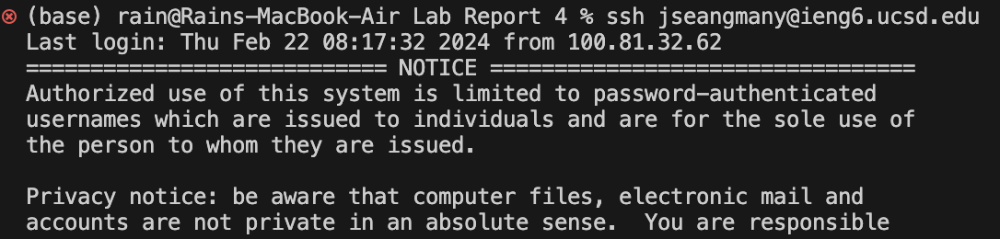
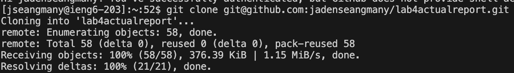
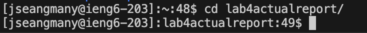
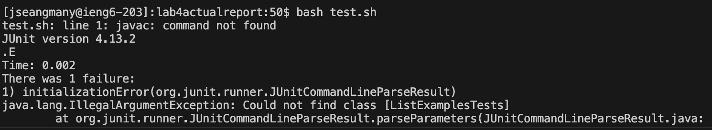
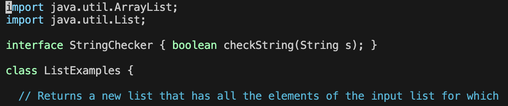
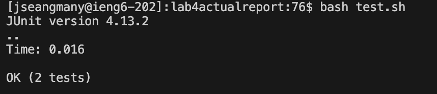
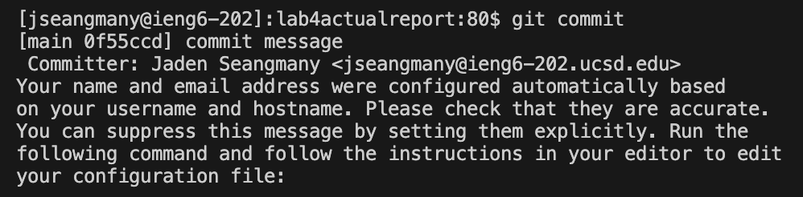

# Lab 4 - VIM
### Step 4 (logging in to ieng6)

For this one, I typed this while testing things earlier, so I only had to press the up arrow key three times. 
Keys pressed: `<up><up><up><enter>`

### Step 5 (git clone)

For this, I just typed in "`git clone`" then pressed space and pasted (CMD + V) in the link that I copied from git hub.

Keys Pressed: `git clone`, `<space><CMD + V><enter>`

### Step 5.5 (CDing into directory)

Here, I had to CD into the directory that I git cloned to so I can access the files. I pressed `<tab>` so I could autofill the exact directory name, "`cd lab4actualreport/`".

Keys Pressed: `cd la`, `<tab><enter>`

### Step 6 (running tests)

Here, I typed in "`bash t`" then pressed tab to autofill and save time, so it typed in the full command "`bash test.sh`".

Keys Pressed: `bash t`, `<tab><enter>`

### Step 7 (editing tests)

Here is where the actual vim editing begins. I typed in "v`im Li`" then pressed `<tab>` to save time and autofill to "`vim ListExamples.java`". Then, I pressed `43J` which basically goes down 43 lines, then pressed `13L` which moves the cursor to the right 13 times, then pressed `R2` which replaces the character I selected to `2`, then typed `:x` which saves and exits vim. Those operations basically located the error that needed to be fixed, and fixed it through the replacement feature, `R`.

Keys Pressed: `43J11LR2:x<enter>`

### Step 8 (running tests)

Now, we can run the tests and see that it works. Here, since it was the same as the second to last previous command that I entered earlier (when the test failed), I just typed the arrow key up twice to get back to it, and pressed enter.

Keys Pressed: `<up><up><enter>`

### Step 9 (commit)

Here, I took the steps to commit the configured file to my github. I ran `git add Li` then pressed `<tab>` to autocomplete `git add ListExamples.java` which stages the changes for github to commit. Then I ran `git commit -m "commit message"` which is literally the only command where I actually had to type the whole thing in, but that just commits the changes. Then I pushed the changes by running the command `git push origin main` which is now the second command where I actually had to type the whole thing, and just pushes the changes to github.

Keys Pressed: `git add Li`,`<tab>`,`git commit -m "commit message"`,`git push origin main`

