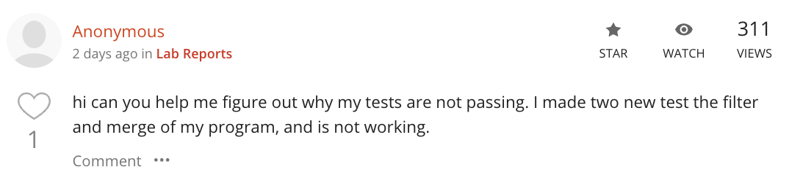
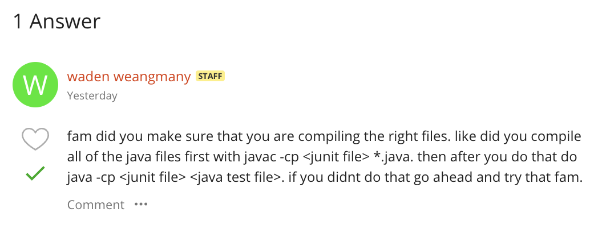

# Part One (EdStem Conversation)
### Post from student

### Guess and Failure-inducing input from student

### Symptom

### Leading question from TA and conversation


### Terminal output from trying TA input #1


### Clear description of what the bug is

### Final working terminal output from trying TA input


## All information needed about setup
### File and Directory structure
Home Directory: `/Users/rain/Documents/CSE15L/lab4`
All the files in this directory:
```
rain@taffys-Laptop lab4 % ls
ArrayExamples.class     FileExample.java        Node.class
ArrayExamples.java      LinkedList.class        StringChecker.class
ArrayTests.class        LinkedListExample.java  lib
ArrayTests.java         ListExamples.class      test.sh
FileExample.class       ListExamples.java
```
### Contents of each file before fixing the bug (I'm just gonna take the files that were edited, and where the bug lied in):

`ListExamples.java`:
```
import java.util.ArrayList;
import java.util.List;

interface StringChecker { boolean checkString(String s); }

class ListExamples {

  // Returns a new list that has all the elements of the input list for which
  // the StringChecker returns true, and not the elements that return false, in
  // the same order they appeared in the input list;
  static List<String> filter(List<String> list, StringChecker sc) {
    List<String> result = new ArrayList<>();
    for(String s: list) {
      if(sc.checkString(s)) {
        result.add(0,s);
      }
    }
    return result;
  }


  // Takes two sorted list of strings (so "a" appears before "b" and so on),
  // and return a new list that has all the strings in both list in sorted order.
  static List<String> merge(List<String> list1, List<String> list2) {
    List<String> result = new ArrayList<>();
    int index1 = 0, index2 = 0;
    while(index1 < list1.size() && index2 < list2.size()) {
      if(list1.get(index1).compareTo(list2.get(index2)) < 0) {
        result.add(list1.get(index1));
        index1 += 1;
      }
      else {
        result.add(list2.get(index2));
        index2 += 1;
      }
    }
    while(index1 < list1.size()) {
      result.add(list1.get(index1));
      index1 += 1;
    }
    while(index2 < list2.size()) {
      result.add(list2.get(index2));
      index1 += 1;
    }
    return result;
  }


}
```
`test.sh` (at the beginning):
```
javac -cp .:lib/hamcrest-core-1.3.jar:lib/junit-4.13.2.jar *.java
java -cp .:lib/hamcrest-core-1.3.jar:lib/junit-4.13.2.jar org.junit.runner.JUnitCore ArrayTests
```
`test.sh` (at the end):
```
javac -cp .:lib/hamcrest-core-1.3.jar:lib/junit-4.13.2.jar ArrayTests
java -cp .:lib/hamcrest-core-1.3.jar:lib/junit-4.13.2.jar org.junit.runner.JUnitCore *.java
```
NOTE:
Basically what happens is at the beginning, the student has the correct bash script to perform the test, and that is how he/she knows about what might be the problem (e.g. the guess that something is wrong with the filter method and the merge method). Then, somehow, due to some computer magic, their bash script changed and it caused the second bash problem (where they got 5 tests and a bunch of error messages).
### Full command line to trigger the bug
In the beginning (this is really just what is inside `test.sh`:
```
javac -cp .:lib/hamcrest-core-1.3.jar:lib/junit-4.13.2.jar *.java
java -cp .:lib/hamcrest-core-1.3.jar:lib/junit-4.13.2.jar org.junit.runner.JUnitCore ArrayTests
```
At the second part/end:
```
javac -cp .:lib/hamcrest-core-1.3.jar:lib/junit-4.13.2.jar ArrayTests
java -cp .:lib/hamcrest-core-1.3.jar:lib/junit-4.13.2.jar org.junit.runner.JUnitCore *.java
```
### Description of what to edit to fix the bug
The student had to go into `ListExamples.java` and edit the merge method at the bottom loop to iterate `index2` instead of `index1`, then they had to edit the filter method at the top from `result.add(0,s)` to `result.add(s)`.

# Part 2: Reflection
With our current technology of editors such as VS Code, I did not know `vim` existed and I thought it was really interesting on how people would edit code before modern editors existed. I also admit that I did not complete the entire vim tutorial, so by doing the vim lab and reading my classmates post, I realized that you could just do like `42L` if you wanted to go to the right 42 times instantly, rather than clicking `L` `42` times like I did initially. I also learned about other ways you could edit quickly, like using `R` to replace, and `X` to delete. Overall, I thought that `vim` is a pretty unique and interesting tool to use to edit files extremely quickly if you know which buttons to press, which was very helpful for one of the previous skill demos.
